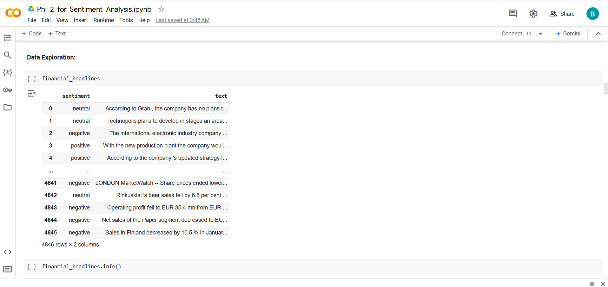
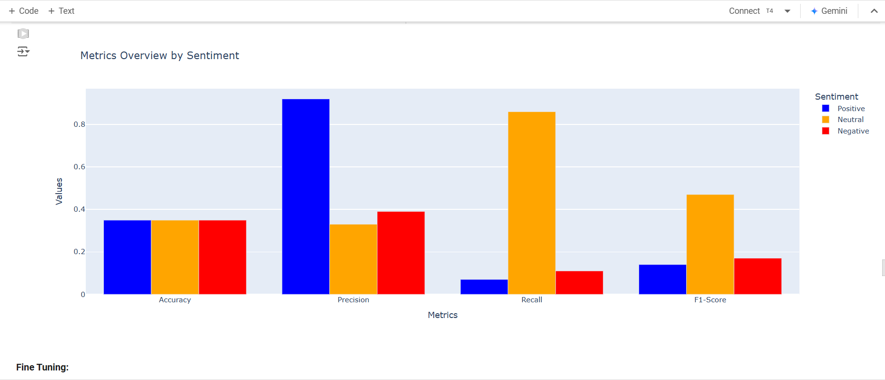
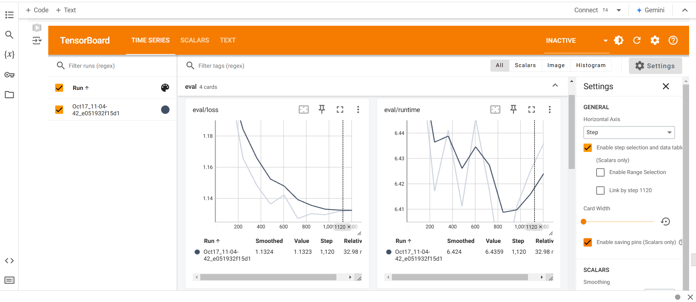

## Fine-Tuning Microsoft Phi-2 for Sentiment Analysis in Finance News Headlines

### Overview
The code aims to develop an efficient **`sentiment analysis`** model for **`financial headlines.`** It involves data preparation, quantization of a pre-trained language model, training, and evaluation with a focus on accuracy and other metrics. Additionally, the model undergoes fine-tuning using **`Low-Rank Adaptation(LoRA),`** and the training progress is monitored using TensorBoard. The ultimate goal is to achieve accurate sentiment predictions for financial data.

### Dataset
- **Source:** "/content/drive/MyDrive/all_financial_sentiment_data.csv"
- **Size:** **`4846 entries, 2 columns ("sentiment," "text")`**
  
**Data Info:** 
- No missing values.
- **Columns:** **`"sentiment" and "text" (object type).`**
- **Label Distribution:** **`"Neutral" (2879), "Positive" (1363), "Negative" (604).`**

**Data Preparation:**
- Balanced split into training and testing sets for each sentiment. Additional evaluation set created.
- Prompts generated for training and evaluation.

### Evaluation:
- Functions defined for model evaluation.
- Predictions made on the test set.
- Overall accuracy, label-specific accuracy, classification report, and confusion matrix presented.

### Quantization:
- Model quantization performed using the **`BitsAndBytesConfig.`**
- Pre-trained model loaded and tokenizer configured.

### Prediction:
- Text generation pipeline created for predictions.
- Predictions made on the test set.

### Visualization:
- Metrics values and labels defined for creating a grouped bar chart.
- Grouped bar chart created using Plotly to visualize metrics overview by sentiment.

### Fine Tuning:
- Functions created to identify the number of layers and last layer linear modules.
- **`LoraConfig`** and **`TrainingArguments`** set up for model fine-tuning.
- **`SFTTrainer`** initialized for model training.
- Model trained and saved in **`trained-model`** directory.

### TensorBoard:
- TensorBoard extension loaded and configured.
- Trainer trained using the **`SFTTrainer`**, and training progress visualized with **`TensorBoard.`**

### Evaluation After Fine Tuning:
- Model predictions and evaluation performed after fine-tuning.
- Overall accuracy, label-specific accuracy, classification report, and confusion matrix presented for the fine-tuned model.

### Metrics Achieved after fine-tuning: 
- Fine-tuning significantly improved overall accuracy from `0.349 to 0.872.` accuracy boost is around `52.3%`
- Accuracy for positive sentiments increased substantially from `0.073 to 0.970 `after fine-tuning.
After fine-tuning, the Accuracy for neutral sentiments slightly decreased from `0.863 to 0.800`.
- Accuracy for negative sentiments improved from `0.110 to 0.847` after fine-tuning.
- The training loss reduced from `1.410000 to 0.873800` during fine-tuning, indicating a significant loss reduction is `38%`.
